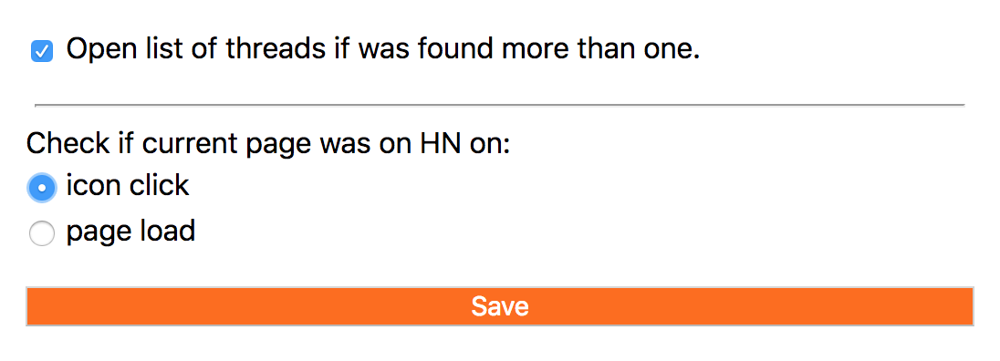

# Was \<some\> page discussed on HN?

This browser extension will help you to find out.

### Can:

- check if page was discussed on Hacker News
- open discussion thread
- submit page on HN if it wan't posted yet

### Install:

- [firefox](https://addons.mozilla.org/en-US/firefox/addon/was-this-page-on-hacker-news/)
- chrome - load in dev mode (maybe some day it will be in store)

## Control

Controlled and visualised by icon in toolbar.

## Legend

- Click to open HN thread:

- Click to check if this page was on HN:

 

- Page not found on HN, click to submit link / do nothing:

 

## Options

